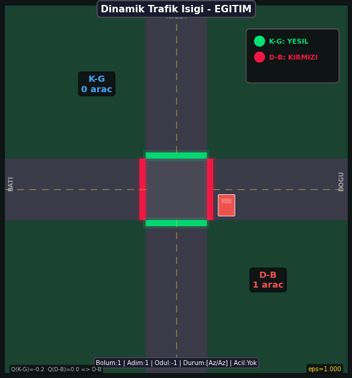
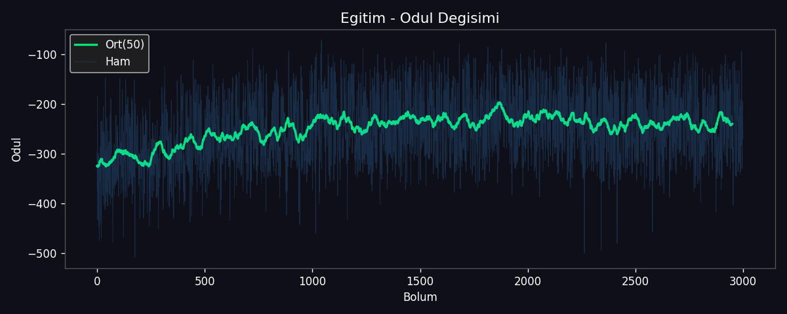
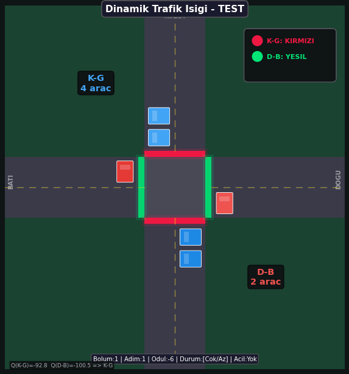

# 🚦 Dinamik Trafik Işığı Kontrolü — Q-Learning

Tek bir kavşakta, **Kuzey-Güney (K-G)** ve **Doğu-Batı (D-B)** yönlerindeki araç yoğunluğuna göre yeşil ışık süresini **Q-Learning** algoritması ile öğrenen bir Reinforcement Learning projesidir.

**Özellikler:**
- Araç yoğunluğuna göre akıllı ışık kontrolü
- **Acil araç desteği** (ambulans/itfaiye) — acil araç geldiğinde ona yeşil verilmesi öğrenilir
- Kuşbakışı (top-down) kavşak animasyonu (GIF)
- Q-Tablosu görselleştirmesi

---

## 📖 İçindekiler

- [Q-Learning Nedir?](#q-learning-nedir)
- [Durum, Aksiyon ve Ödül](#durum-aksiyon-ve-ödül)
- [Acil Araç Sistemi](#acil-araç-sistemi)
- [Kurulum ve Çalıştırma](#kurulum-ve-çalıştırma)
- [Sonuçlar](#sonuçlar)
- [Dosya Yapısı](#dosya-yapısı)
- [Hiperparametreler](#hiperparametreler)

---

## Q-Learning Nedir?

Q-Learning, **model-free** bir pekiştirmeli öğrenme algoritmasıdır. Ajan, deneme-yanılma ile en iyi aksiyonları öğrenir.

### Güncelleme Formülü

```
Q(s, a) ← Q(s, a) + α · [ r + γ · max Q(s', a') − Q(s, a) ]
```

| Sembol | Anlamı | Değer |
|--------|--------|-------|
| `α` (alfa) | Öğrenme oranı | 0.2 |
| `γ` (gamma) | İndirim faktörü | 0.9 |
| `ε` (epsilon) | Keşif oranı | 1.0 → 0.01 |

### Epsilon-Greedy Stratejisi

- `ε` olasılıkla → **rastgele aksiyon** (keşif/exploration)
- `1-ε` olasılıkla → **en iyi bilinen aksiyon** (sömürü/exploitation)

Eğitim başında `ε=1.0` (tamamen rastgele), zamanla `0.01`'e düşer.

---

## Durum, Aksiyon ve Ödül

### Durum (State) — 12 farklı durum

Her yön için yoğunluk (Az/Çok) + acil araç durumu:

| Yoğunluk (K-G, D-B) | Acil Yok | Acil K-G'de | Acil D-B'de |
|----------------------|----------|-------------|-------------|
| Az / Az | Durum 0 | Durum 4 | Durum 8 |
| Az / Çok | Durum 1 | Durum 5 | Durum 9 |
| Çok / Az | Durum 2 | Durum 6 | Durum 10 |
| Çok / Çok | Durum 3 | Durum 7 | Durum 11 |

### Aksiyon (Action) — 2 farklı aksiyon

| Aksiyon | Açıklama |
|---------|----------|
| 0 | K-G (Kuzey-Güney) yeşil ışığı uzat |
| 1 | D-B (Doğu-Batı) yeşil ışığı uzat |

### Ödül (Reward)

```
Ödül = −(Toplam Bekleyen Araç) + Acil Araç Bonusu/Cezası
```

| Durum | Ödül |
|-------|------|
| Normal | −(bekleyen araç sayısı) |
| Acil araca yeşil verildi | +10 bonus |
| Acil araca kırmızı verildi | −20 ceza |

---

## Acil Araç Sistemi

Her adımda **%8 olasılıkla** bir acil araç (ambulans veya itfaiye) rastgele bir yönde belirir.

- **Ambulans**: Beyaz araç, kırmızı haç işareti
- **İtfaiye**: Turuncu araç, sarı şerit

Ajan, acil araç geldiğinde o yöne yeşil ışık vermeyi öğrenir çünkü:
- Doğru yöne yeşil → **+10 bonus** (acil araç geçer)
- Yanlış yöne yeşil → **−20 ceza** (acil araç bekler)

Bu ödül yapısı sayesinde Q-Tablosunda acil araç olan durumlar için **doğru yön her zaman tercih edilir**.

---

## Kurulum ve Çalıştırma

### Gereksinimler

```bash
pip install numpy matplotlib pillow
```

### Çalıştırma

```bash
python trafik_isigi.py
```

Çıktılar `gifs/` klasöründe oluşur:
- `egitim.gif` — Eğitim süreci animasyonu
- `test.gif` — Test süreci animasyonu
- `odul_grafigi.png` — Ödül değişim grafiği

---

## Sonuçlar

### Eğitim Aşaması (Learning)

Eğitim sırasında ajan keşif yaparak Q-Tablosunu günceller. GIF'te farklı eğitim aşamalarından (başlangıç, orta, son) ardışık adımlar gösterilir:



### Ödül Grafiği

Eğitim boyunca toplam ödülün nasıl değiştiğini gösterir:



### Test Aşaması (Running)

Eğitim sonrası `ε=0` ile çalıştırılır — sadece öğrenilen en iyi aksiyonlar uygulanır:



### Q-Tablosu

Eğitim sonunda beklenen Q-Tablosu davranışı:

| Durum | Beklenen En İyi Aksiyon |
|-------|------------------------|
| Çok/Az, Acil Yok | K-G Yeşil (yoğun taraf) |
| Az/Çok, Acil Yok | D-B Yeşil (yoğun taraf) |
| *, Acil K-G | K-G Yeşil (acil araca yol ver) |
| *, Acil D-B | D-B Yeşil (acil araca yol ver) |

---

## Dosya Yapısı

```
deep_rl_btu_vize/
├── trafik_isigi.py        # Tek dosyada: ortam, ajan, görselleştirme, eğitim, test
├── README.md              # Bu dosya
└── gifs/                  # Çalıştırıldıktan sonra oluşur
    ├── egitim.gif         # Eğitim animasyonu
    ├── test.gif           # Test animasyonu
    └── odul_grafigi.png   # Ödül grafiği
```

---

## Hiperparametreler

| Parametre | Değer | Açıklama |
|-----------|-------|----------|
| `alfa (α)` | 0.2 | Öğrenme oranı |
| `gamma (γ)` | 0.9 | İndirim faktörü |
| `epsilon (ε)` | 1.0 → 0.01 | Keşif oranı |
| `epsilon_azalma` | 0.997 | Her bölümde epsilon çarpanı |
| `episode_sayisi` | 3000 | Eğitim bölüm sayısı |
| `adim_sayisi` | 25 | Bölüm başına adım |
| `yogunluk_esigi` | 4 | Az/Çok sınırı |
| `MAX_ARAC` | 12 | Bir yönde maks araç |
| `ACIL_OLASILIK` | 0.08 | Adım başına acil araç olasılığı |
| Acil yeşil bonusu | +10 | Doğru yöne yeşil ödülü |
| Acil kırmızı cezası | -20 | Yanlış yöne yeşil cezası |

---

## Nasıl Çalışır? (Adım Adım)

1. Kavşak rastgele araç sayılarıyla başlar
2. Ajan durumu gözlemler → (yoğunluk + acil araç bilgisi)
3. Epsilon-greedy ile aksiyon seçer (K-G veya D-B yeşil)
4. Yeşil olan yönden 2-4 araç geçer
5. Her yöne 0-3 yeni araç gelir
6. %8 olasılıkla acil araç belirir
7. Ödül hesaplanır → -(bekleyen) + acil bonus/ceza
8. Q-Tablosu güncellenir
9. Epsilon azaltılır (zamanla daha az keşif)
10. 3000 bölüm sonunda ajan optimal politikayı öğrenmiş olur
